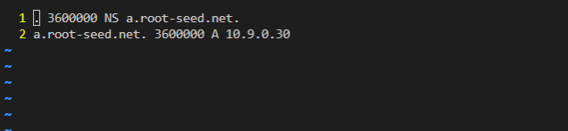
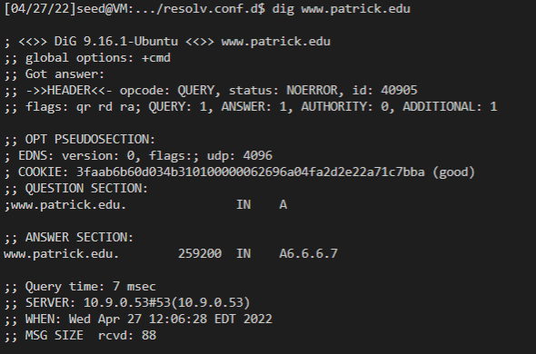

# DNS In a Box

## Task l: Building the nameserver for example.edu

Just follows the steps you can get the correct result.

---

---

---

However, there are something you need to pay extra attention to.

1. you should to modify the files inside `Labsetup/nameserver/edu.exmaple` instead of modifying them inside the docker container instance. this would make the modification more easy to manage.
2. after modification, you should always modify use `docker-compose build` to rebulid the container before `docker-compose up`, otherwise, the modification in the files including `Labsetup/nameserver/edu.exmaple` would not work.

## Task 2: Building the edu TLD server

The task is also easy.

---

---

---

---

## Task 4(3): Building root server

---

---

---

---

## Task 5(4): Building the Local DNS Server

This task seems mysterious for me at first. No matter how I change the root server name in the root.hints, it only return the same result which is `root.seed.net.` when I type `dig @10.9.0.53`. Finally, I find that this is because the settings of root.db of the root server, to make things easier, we just left the root server unchanged.

---

---

So I just directly set the name of the local server to be `root.seed.net.` in the root.hints like the following:

---

---

Testing results:

---

However, I cannot lookup the IP of the www.syr.edu correctly. I guess the Syracuse University may set this address nonavailable.

## Task 6(5): Configure our VM to use this local DNS server

Just follow the instruction.

---

result

---

## Task 7: Making It More Realistic

This task may be a little bit troublesome. However, must operations is simply copy and paste. For convinience, I just set one tld for my customized server. It would not be difficult to set another one.

---

Three root server

---

customize tld for personal address
