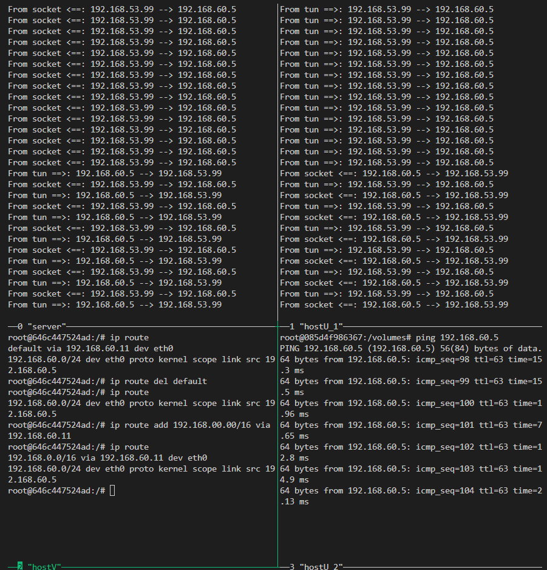

# VPN Lab: The Container Version

## Task 2: Create and Configure TUN Interface

### Task 2.a: Name of the Interface

Just modify the command passing to the file descriptor, which is tun, then we could set the name.

---

---

---

### Task 2.b: Set up the TUN Interface

Modify the codes just as the instruction said, then we could get the expected result.

---

---

---

### Task 2.c: Read from the TUN Interface

After modification, the program could print out the packets it received via tun interface.

---
**ping 192.168.53.00/24**

---

**ping 192.168.60.00/24**

---

from above results, we can find that ICMP packets to 192.168.53.00/24 would be successfully received while those from 192.168.60.00/24 would not. the reason is quite straightfore, since when do configuration for tun interface, we only use it to capture the packets in the 192.168.53.00/24 subnet. this is also reflected in the routing table:

---

### Task 2.d: Write to the TUN Interface

just follow the instructions and modify slightly, we could get the result.

---

spoof ICMP reply:

---

wrting arbitrary data:

---

## Task 3: Send the IP Packet to VPN Server Through a Tunnel

For the server part, we just create a file inside the volumes folder like the instruction said, and then executed.

---

**ping 192.168.53.0/24**

---

**ping 192.168.60.5/24 before adding new route rule**

---

**ping 192.168.60.5/24 after adding new route rule**

---

## Task 4: Set Up the VPN Server

this task is simply combine the former code of server and client

---

---

---

## Task 5: Handling Traffic in Both Directions

i find something tricky in this task. it seems that TUN can only write the packet with valid ip within the TUN interface to the network stack. anyway, instead of writing the upd packet inside the network stack and send it out, we could directly send out upd packets using sockets.

---

---

Notice that is the server part, I use a simple dict to make it kind of reasonable cause server could not dedicated to server one client. however, it is far more insufficient to use the inside packets' ips to denote their ports. i donnot further improve it cause it is not the most important issue in the lab

---

## Task 6: Tunnel-Breaking Experiment

---

if stopping client and server after connection, the telnet program will kind of stuck there

---

after resume the connection, once hit the keyboard, the telnet program would then send all the command typed during the breaking of client and server program, and then resumed to work normally.

---

## Task 7: Routing Experiment on Host V

after deleting the default routing rule, the ICMP reply would disappear immediately

---

then we could add a specific routing rule to allow 192.168.00.00/24 passing through eth0, but anyway, i guess deleting default rule is generally not a good idea for usage

---

## Task 8: VPN Between Private Networks

after setting the enviroment using `docker-compose -f docker-compose2.yml build; docker-compose -f docker-compose2.yml up`, we just need to modify the ip and setting up the route tables for server, clien, hostU and hostV then it will works properlly.

--- 

the setting for VPN client is changed, so we only need to modify its part like following:

--- 

now we test ping from host U to host V, notice that the routing table is set in as the first few lines in each pane shown in the screenshot:

---

after the ip of client VPN is cached in my server VPN program, that is, the ip and ports stored in the simple dictionary in codes, then we could ping from hostV back to hostU

---

## Task 9: Experiment with the TAP Interface

this task is just get some feeling about the tap, just follow the instruction and we will get the expected result

