# Firewall Exploration Lab

## Task 1: Implementing a Simple Firewall

### Task 1.A: Implement a Simple Kernel Module

just follow the instruction would be fine

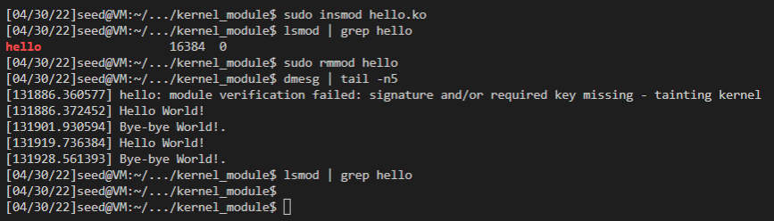

---

### Task 1.B: Implement a Simple Firewall Using Netfilter

just follow the instruction would be fine

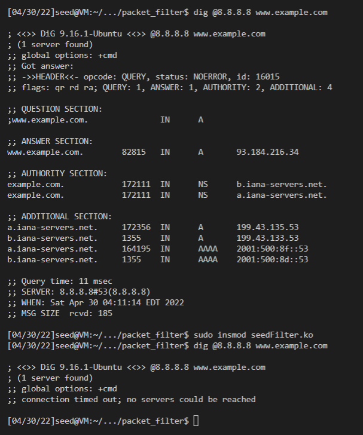

---

we just iterate through all the possible hook positions and register hook code
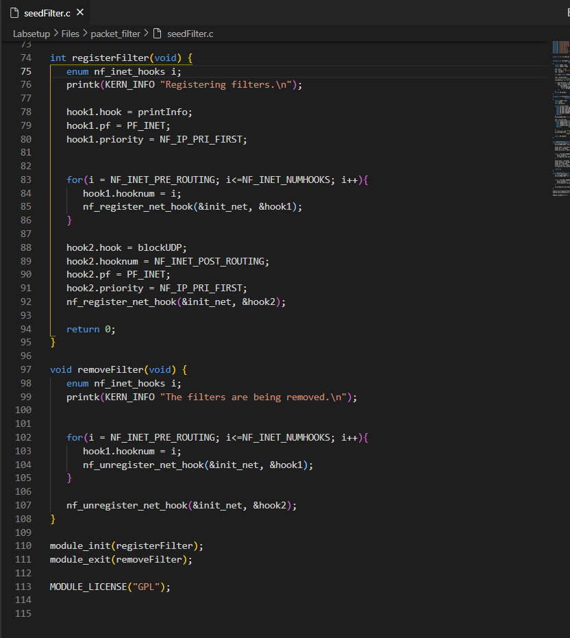

Notice that we may not see the forwarding in the result since the VM currently is not capturing packets needed to be forwarded
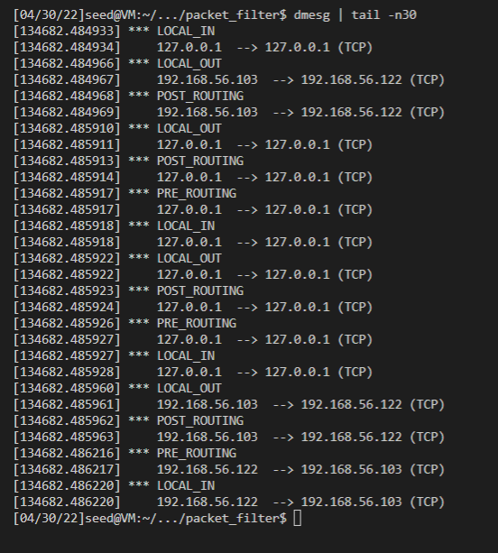

---

we modify the functions just like the udp, then we could solve this task, notice that you may need to include <linux/icmp.h>

```c
#include <linux/kernel.h>
#include <linux/module.h>
#include <linux/netfilter.h>
#include <linux/netfilter_ipv4.h>
#include <linux/ip.h>
#include <linux/tcp.h>
#include <linux/udp.h>
#include <linux/icmp.h>
#include <linux/if_ether.h>
#include <linux/inet.h>


static struct nf_hook_ops hook; 


unsigned int blockTelnet(void *priv, struct sk_buff *skb,
                       const struct nf_hook_state *state)
{
   struct iphdr *iph;
   struct tcphdr *tcph;

   u16  port   = 23;
   char ip[16] = "10.9.0.1";
   u32  ip_addr;

   if (!skb) return NF_ACCEPT;

   iph = ip_hdr(skb);
   // Convert the IPv4 address from dotted decimal to 32-bit binary
   in4_pton(ip, -1, (u8 *)&ip_addr, '\0', NULL);

   if (iph->protocol == IPPROTO_TCP) {
       tcph = tcp_hdr(skb);
       if (iph->daddr == ip_addr && ntohs(tcph->dest) == port){
            printk(KERN_WARNING "*** Dropping %pI4 (Telnet), port %d\n", &(iph->daddr), port);
            return NF_DROP;
        }
   }
   return NF_ACCEPT;
}

unsigned int blockPing(void *priv, struct sk_buff *skb,
                       const struct nf_hook_state *state)
{
   struct iphdr *iph;
   struct icmphdr *icmph;

   char ip[16] = "10.9.0.1";
   u32  ip_addr;

   if (!skb) return NF_ACCEPT;

   iph = ip_hdr(skb);
   // Convert the IPv4 address from dotted decimal to 32-bit binary
   in4_pton(ip, -1, (u8 *)&ip_addr, '\0', NULL);

   if (iph->protocol == IPPROTO_ICMP) {
       icmph = icmp_hdr(skb);
       if (iph->daddr == ip_addr && icmph->type == 8){
            printk(KERN_WARNING "*** Dropping %pI4 (ICMP request)\n", &(iph->daddr));
            return NF_DROP;
         }
   }
   return NF_ACCEPT;
}


int registerFilter(void) {
   
   printk(KERN_INFO "Registering filters.\n");

   hook.hook = blockTelnet;
   hook.hooknum = NF_INET_PRE_ROUTING;
   hook.pf = PF_INET;
   hook.priority = NF_IP_PRI_FIRST;
   nf_register_net_hook(&init_net, &hook);

   hook.hook = blockPing;
   nf_register_net_hook(&init_net, &hook);

   return 0;
}

void removeFilter(void) {
   
   printk(KERN_INFO "The filters are being removed.\n");

   hook.hook = blockPing;
   nf_unregister_net_hook(&init_net, &hook);

   hook.hook = blockTelnet;
   nf_unregister_net_hook(&init_net, &hook);
}

module_init(registerFilter);
module_exit(removeFilter);

MODULE_LICENSE("GPL");

```

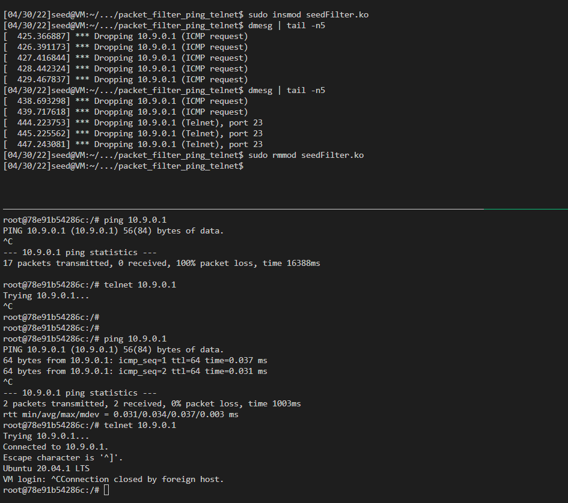


## Using iptables

### Task 2.A: Protecting the Router

just follow the instruction

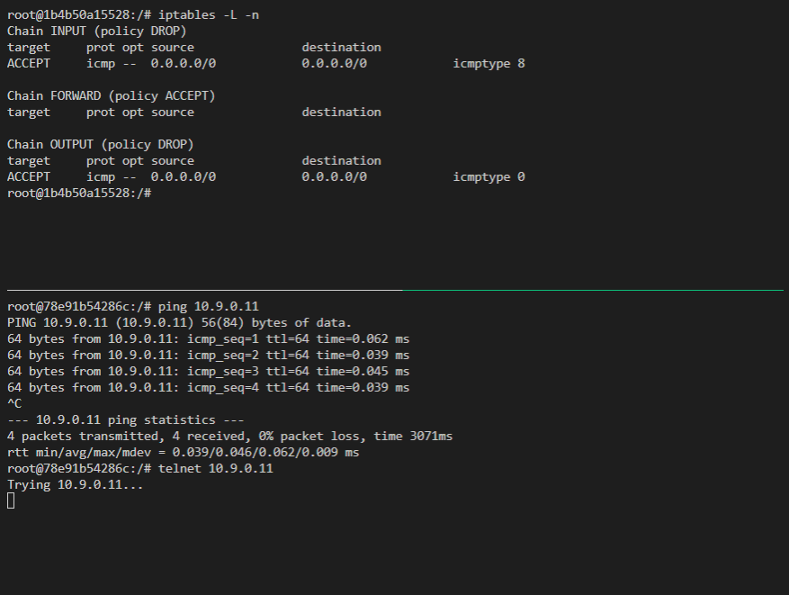

### Task 2.B: Protecting the Internal Network

1. we need to set the default policy to be drop to reject all other types of packets
2. we need to allows the internal hosts's icmp packages to be transformed smoothly, that is allows all the icmp packages comming via eth1
3. we need to make sure that the outside host's icmp reply could come in the internal network, so that the internal hosts could ping outside hosts

---

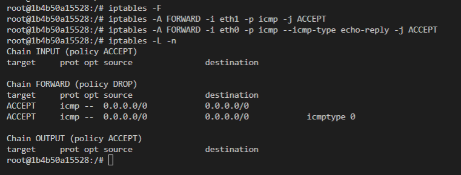

### Task 2.C: Protecting Internal Servers

1. forward outside hosts' telnet packet to 192.168.60.5
2. forward 192.168.60.5's telnet packet to outside hosts
3. forward all inside subnet hosts' telnet packets
4. set default forward policy to drop

---

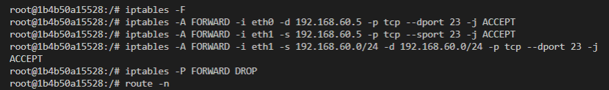

---

## Task 3: Connection Tracking and Stateful Firewall

### Task 3.A: Experiment with the Connection Tracking

icmp roughly maintain for 30s

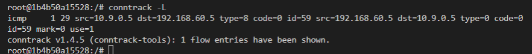

---

udp roughly maintain for 30s

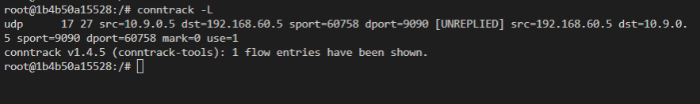

---

tcp connection will remain quite long, around 432000s

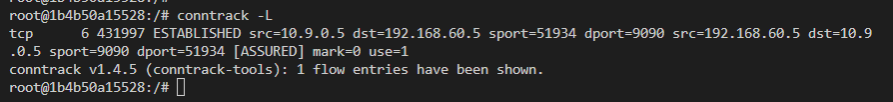

### Task 3.B: Setting Up a Stateful Firewall

stateful rules:
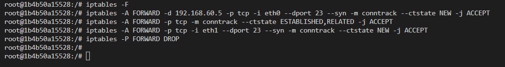

---

stateless rules:
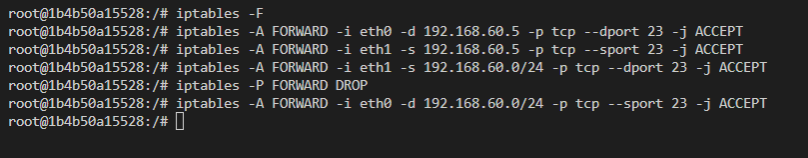

---

- stateful rules:
  - pros: 
    have a more accurate control of the TCP establishing process
  - cons:
    rules are more complicated
- stateless rules: (basically is the opposite of the stateful rules' pros and cons)
  - pros:
    simple desgin
  - cons:
    have a less accurate control of the TCP establishing process

## Task 4: Limiting Network Traffic

without 2nd rule
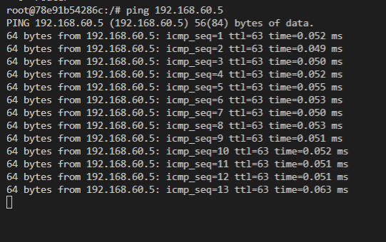

---

with 2nd rule
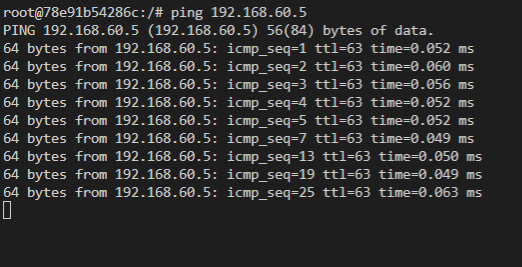

---

from above, we can see that after adding the 2nd rule, iptables works "correctly". the reason is quite simply, seems although our first rule would drop this packet, maybe there are other rules macthed to let it pass. in this case, our FORWARD policy is ACCEPT by default

## Task 5: Load Balancing

it seems that once matched, the packet would be passed to next chain immediately, so to solve this problem, we would make server1 operate on the packets every 3 packets, server2 operate on the packets every 2 packets and server3 operate on the packets every 1 packets. 
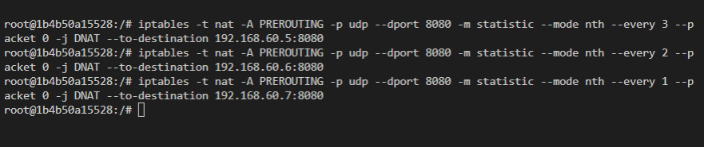
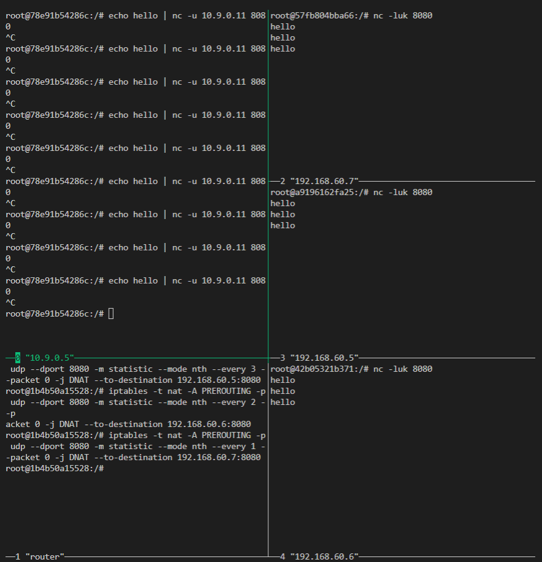

---

do remember to remove the rules set up above, seems docker has set many rules inside the nat table, **we could not simply flush it!!!**, instead, we should remove the rules setup by ourselves one by one
like above example, we just set the server1 has probability of 0.33 to capture the packet, then server2 has the probability of 0.5 to capture the packets not captured by server1, and finally server3 woudl capture all remaining packets.

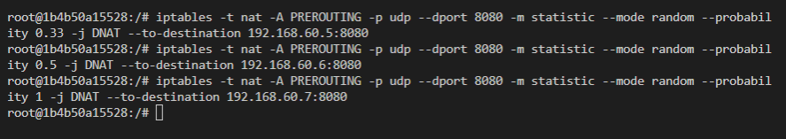
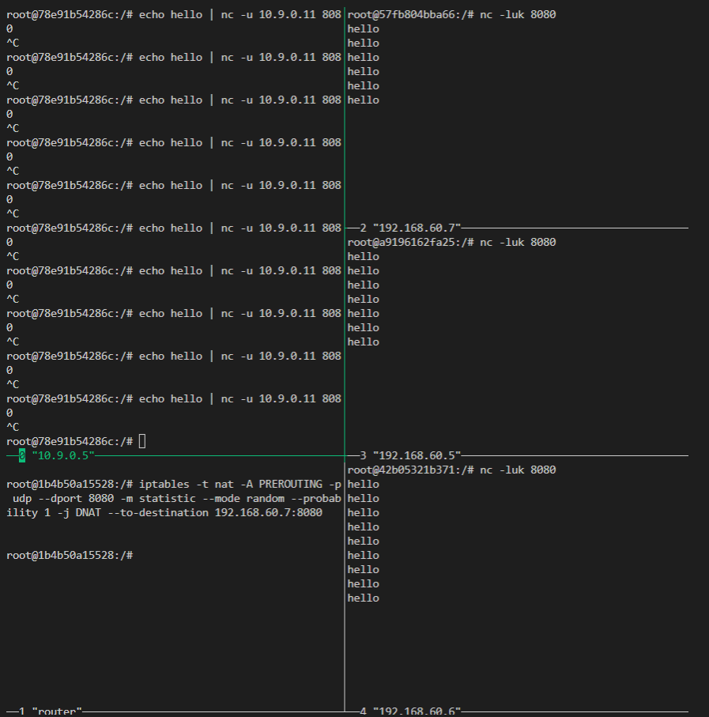