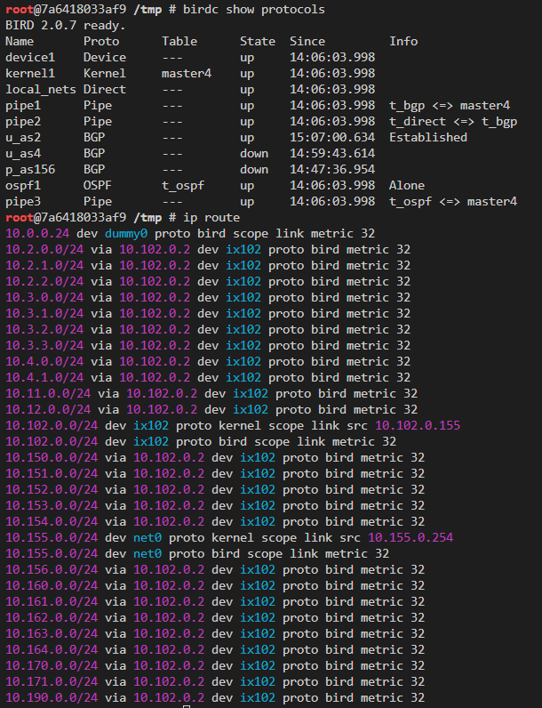
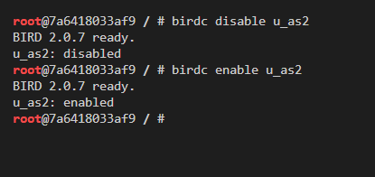

# BGP Exploration and Attack Lab

## Task 1: Stub Autonomous System

### Task 1.a: Understanding AS-155’s BGP Configuration

#### Task 1.a.1

it is easy to see that AS-155 peers with AS-2 (10.102.0.2)

#### Task 1.a.2

we can compare the result of several results:

---

first, disable all connected AS, that is, AS_2, AS_4 and AS_156, after a while, the route tables would shrink a lot:

---

only turn on **AS_4**

---

only turn on **AS_2**

### Task 1.b: Observing BGP UPDATE Messages

we only need to disable one peer of AS150 and enable it, and this would be sufficient enough to generate UPDATE message to withdraw and update. the reason is quite simple, since the best approach for AS150's neighbor to reach AS150 is access it through this direct bgp session. thus, once we disable bgp peering with the one neighbor, this neighbor would definitely have to adjust its best path to reach AS150 which is directly connecting to AS150.

---

operations in AS150:

---

withdraw message from AS2

---

update message from AS2

### Task 1.c: Experimenting with Large Communities

to mimic service between AS156 and AS4 is broken, we could simply disable the bgp protocol in the AS156 side

---

change AS155's service to transit route to AS156

---

correspondingly, change AS156's settings to accept AS155

### Task 1.d: Configuring AS-180

first, we need to construct a bgp table in birdc and define several communitiy variables

---

then, we could start to peer with AS171,
peer from AS180 to AS171

peer from AS171 to AS180

---

next, we could set up provider and customer relationship of AS180 and AS2 and AS3
AS180 accept AS2 and AS3's server

---

also, we need to make sure AS2 and AS3 provide corresponding service to AS180

## Task 2: Transit Autonomous System

### Task 2.a: Experimenting with IBGP

in this task, we will check the behavior of the routing table of AS3 at IX103. we will ping from host 10.162.0.72(connect AS3 at IX103) to 10.164.0.71(connect AS3 at IX104). during the task, we will disable the ibgp3 which connecting AS3 at IX103 and at IX104. 

---

ping will stuck once disable ibgp3 at AS# at IX103

---

actually, from the routing table at the AS3 at IX103, we could find that the route to the 10.164.0.0/24 will disappear

before disabling:

after disabling:

### Task 2.b: Experimenting with IGP

after disabling ospf1, the route of AS3 at IX103 would only contain information to all the subnets inside this IX103.

### Task 2.c: Configuring AS-5

---

ibgp1 set the connection between AS5 IX101 with AS5 at IX103 while ibgp2 connect AS5 IX101 with AS5 at IX105

---
as mimic the peer configuration we done at task1, we could finish this task.
the following is the result from AS5 at IX101

this task involing modification in many files, which i would not show screenshots here, however, you could check the files in the task2 folder.

---

as mimic the steps above, we could finish the task

like above, modification in files would not shown here, instead would be put in the folder task2

## Task 3: Path Selection

### Task 3.a.

in AS150, for 10.161.0.0/24, we can find there are 2 pathes available:

these 2 pathes have same local preference but the first option has smaller AS path length, therefore, it is more preferable and we can see a * is put on the first line of it.

and it is indeed the chosen path passed to kernel

### Task 3.b.

basically, all necessary steps are shown in the section 8 of Prof. Du's book.

notice that, reconfigure is required to make modification take effect

---

for inbound traffic, we could lower the local preference for AS2

before modification, we can find some route using AS2

after modification, we have all routes passing with AS3

---

for outbound traffic, we could prepend itself to route passing to AS2, like the followings:

to check the result, we could check on the outside host, follow the book, i also checked the traffic on AS154

before modification, we can find it pass packets via AS2

after modification, it choose another route

## Task 4: IP Anycast

after trying many host to ping 10.190.0.100, I found that they all ping to the 190host1. to better test the effect, I peer AS151 with AS190 directly at IX100.

## Task 5: BGP Prefix Attack

all the detailed operatoins are taught in section 12

### Task 5.a. Launching the Prefix Hijacking Attack from AS-161

attacker would conduct attack like the following in AS161

before attack:

after attack:

---

### Task 5.b. Fighting Back from AS-154

to fight back, AS154 would need to advertise more specific ip:

after change, we have:

---

### Task 5.c. Fixing the Problem at AS-3

for AS3, one of easy way to ban AS161's attack would simply is simply only allowing packet within 10.154.0.0/24 to go out from AS161

