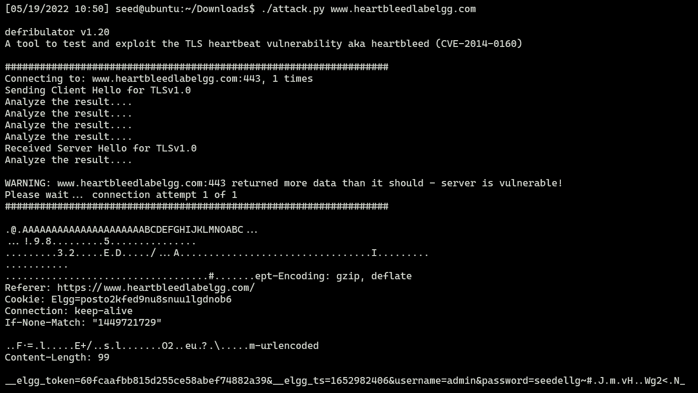
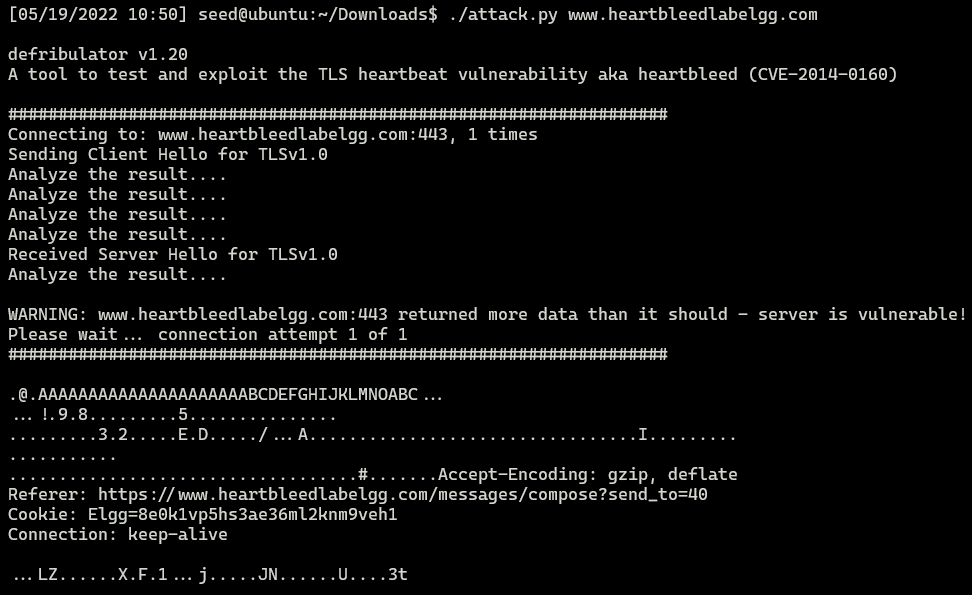
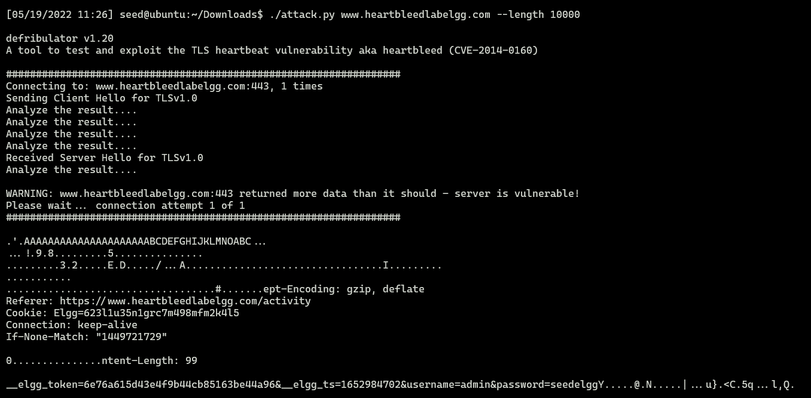
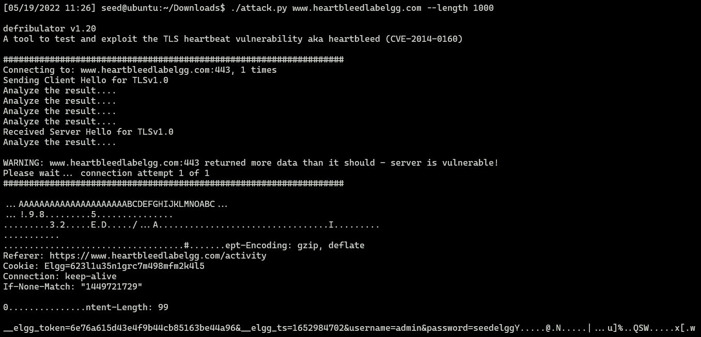
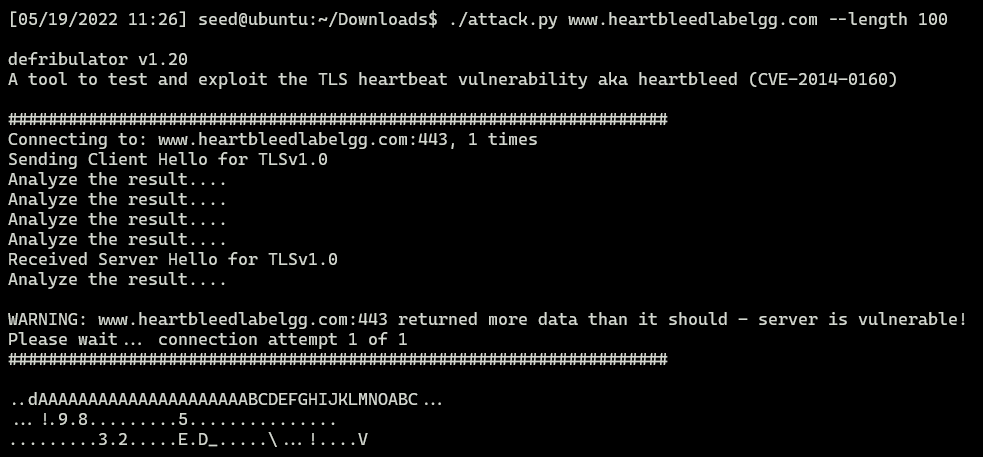

# Heartbleed Attack Lab

## Task 1: Launch the Heartbleed Attack

after trying for multiple times:

- User name and password



- User’s activity (what the user has done)



- The exact content of the private message


## Task 2: Find the Cause of the Heartbleed Vulnerability

### Question 2.1
results:




from observation, it is obvious that the lengthes of the responds from the server decrease. thus, it is less likely for attack with small length to obtain private data

### Question 2.2

after trying for many times, we can find the boundary is 22, that is, if setting the request length larger than 22, we can obtain extra data.


## Task 3: Countermeasure and Bug Fix

### Task 3.1

for this task, i could not finish it because for some reason i could not connect to the source listed in the apt. i also tried many other available resource links but it seems that they are no longer maintaied. and the operations of this task donnot involve much complex operations, so i just skip it.

### Task 3.2

notice that in this part, the program copy the data directly from the packet pointer
```c
    // copy payload
    memcpy(bp, pl, payload); /* pl is the pointer which
    * points to the beginning
    * of the payload content */
```
and the length of the data to copy is 
```c
    // Read from the payload_length field
    // from the request packet
    n2s(p, payload); /* Function n2s(p, payload) reads 16 bits
    * from pointer p and store the value
    * in the INT variable "payload". */
```
to fix this program, extra checking of the length field in the request packet is needed. one possible way is to compared the length filed with the actual length of the request packet and make sure the length filed is strictly not larger than payload and padding part of the request packet.

---

for Alice: I agree with her, boundary checking will make sure that no extra data outside the request packet will be leaked.

for Bob: this is not a good idea. usually, user input validation is happened on the applications layer. however, attackers can always constructed packet in the lower layer to bypass user input validation.

for Eve: this is neither a good idea. if we deleting length value, which means we need to make the length of payload is fixed. if the attacker know about the length of the pakcet, the attackers will no need to guess the actual length of the payload, thus make attacking easier.