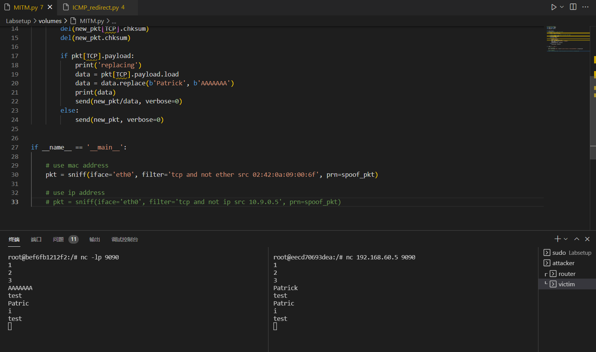

# ICMP redirect

## Task 1

### successful attack

result:

After redirect, the route cahce of victim was changed.
**Notice**: if attacker simply send out the redirected ICMP, it won't work. Attacker need to send it during victim is sending real ICMP (which is mentioned in the strange thing). Also, you need to disable packet forwarding in the victim machine by ('sysctl net.ipv4.ip_forward=0') which is already set by default.

### Question 1

result:

No. After trying, the route cache of the victim does not change.

### Question 2

result:

No. After trying, the route cache of the victim does not change.

## Task 2

### successful attack

result:

Basically, just modify the codes from last lab (lab2) then we got the answer. Notice that we need to make sure the malicious router not capturing the spooffed packet sent by itselt otherwise it will go into a infinite loop. To achieve this, we simply not capturing the packet sent from its MAC address.

### Question 4

We only need to capture the packet from **victim** to **route** since we only want to modify the packet sent from victim.

### Question 5

The better choice is use A's MAC address

- Use A's IP address
  

As you can see from the result, spoofing nearly not working in this scenario. Since the filter detects all packet with source ip '10.9.0.5', it will detect the spoofed packet from itself. Therefore, it will stuck in a endless loop handling one packet. And this may cause some trouble to spoof the new incoming packets.

- Use A's MAC address
  

The spoofing works successfully in this case since it won't stuck in the endless loop like the one using IP address.
