# TCP Attack

## Task 1: SYN Flooding Attack

 

### 1.1: Launching the Attack Using Python

 

**Notice** that you need to flush the tcp metrics in victim by "ip tcp_metrics flush", 
otherwise the connection could still be established from user in victim during SYN flooding  

**code**  
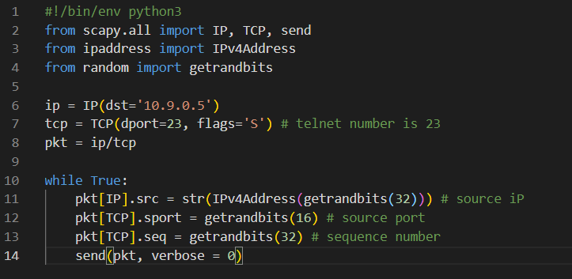

 

**victim**  
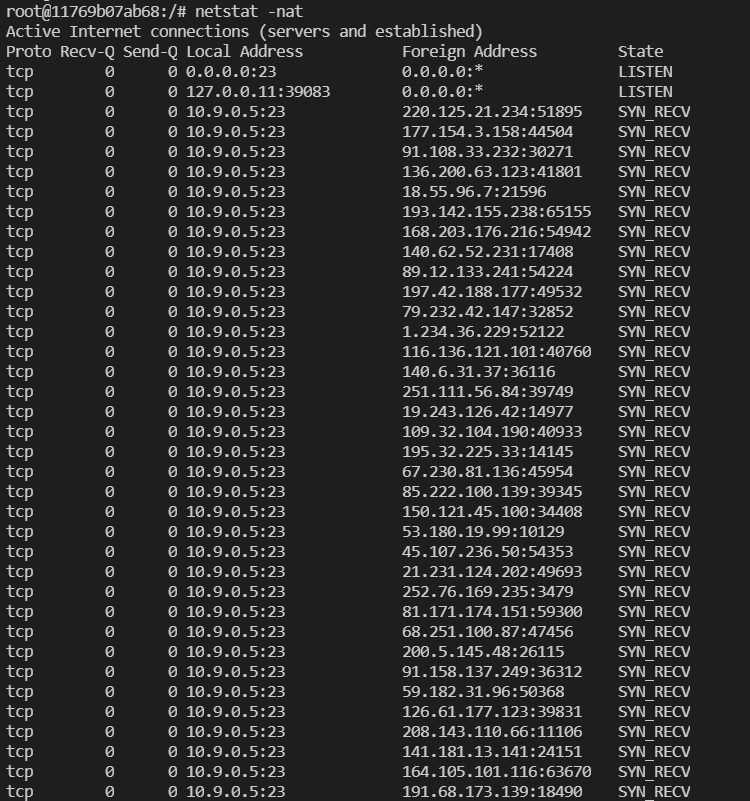

 

**user1**  
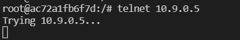

### 1.2: Launching the Attack Using C

**code**  
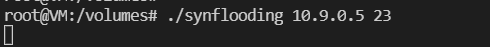

 

**victim**  
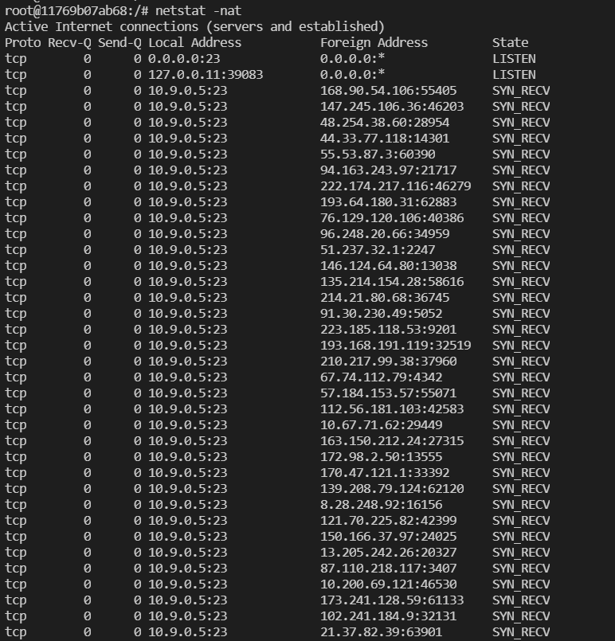

 

**user1**  
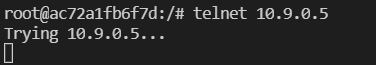

comparing with using python the speed of using C is defintely faster.

### 1.3: Victim turn on SYNCookies

First, let's turn on the syncookies setting.

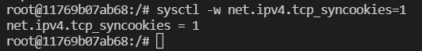  

Then flush the tcp metrics in victim by "ip tcp_metrics flush" and start attacker.  

As we can see, victim's ip table is already full.  
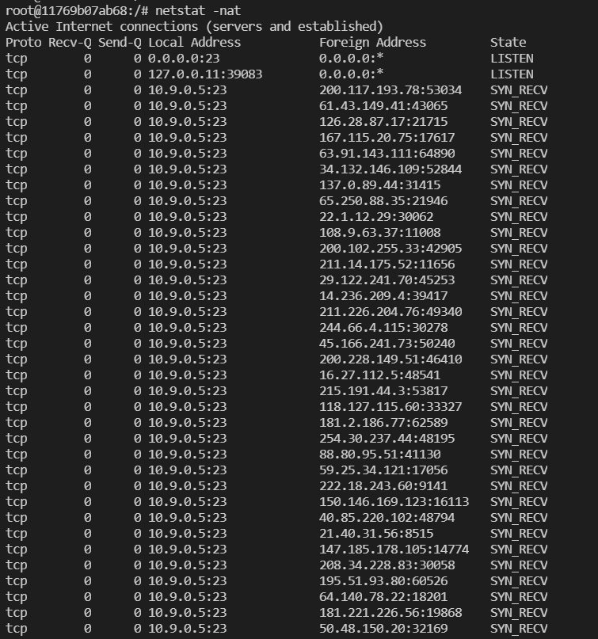  

However, the user1 could still connect to victim.  
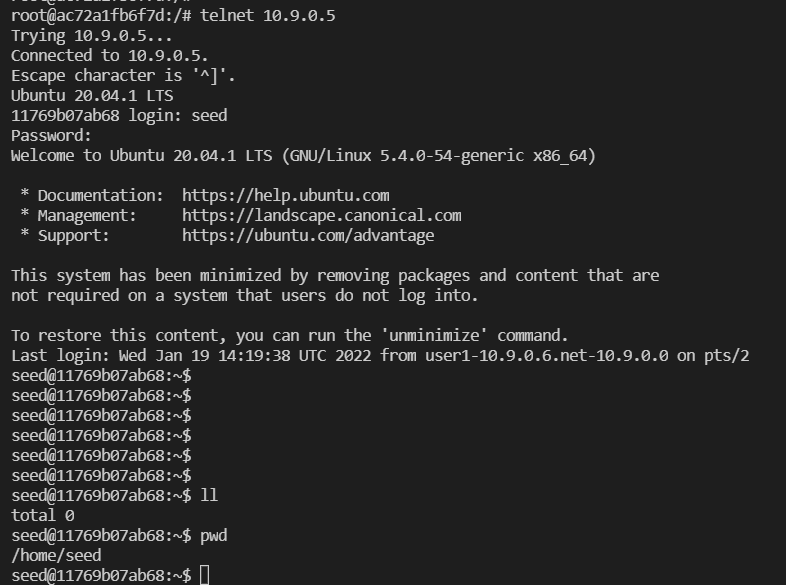

## Task 2: TCP RST Attacks on telnet Connections

codes:  
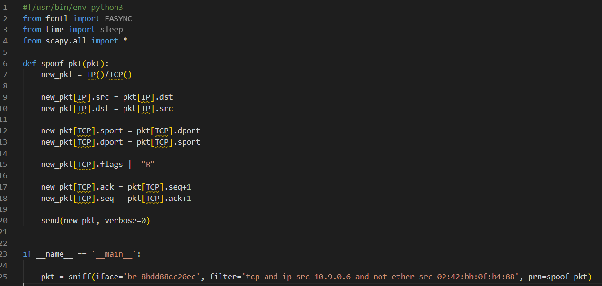

 
After we run the program on attacker, as long as we type anything (except enter) the connection will be reset automatically.  
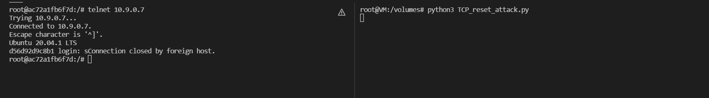

## Task 3: TCP Session Hijacking

codes

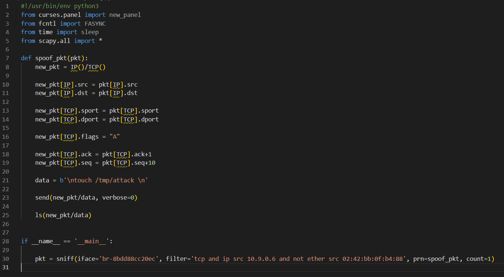

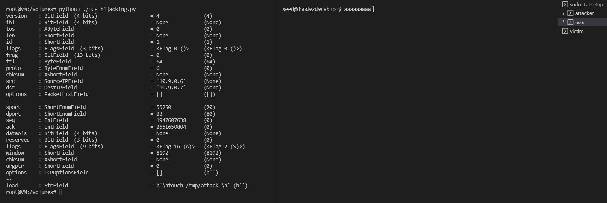

 
After attacker sending out the packet, the user's terminal will freeze after typing 10 characters since user would never receiver ack = last_seq + 1

## Task 4: Creating Reverse Shell using TCP Session Hijacking

this task is pretty much the same as task 3 except that you need to replace the code in the spooffed packet and need to use netcat to open wait the redirect tcp traffic from victim sercer.

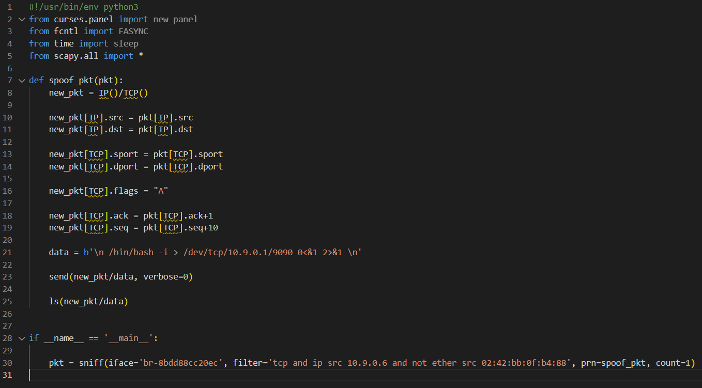

 

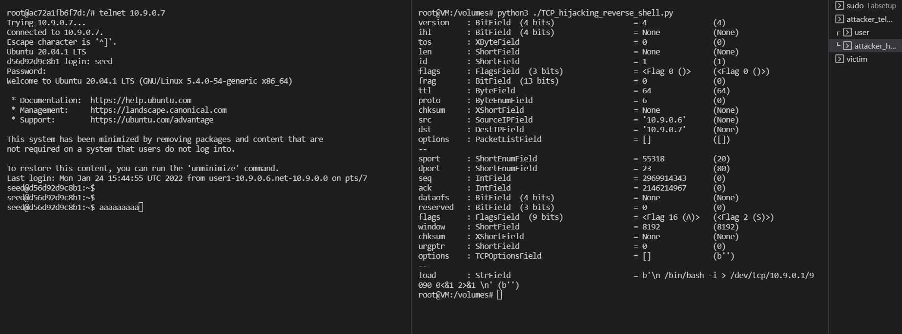

 

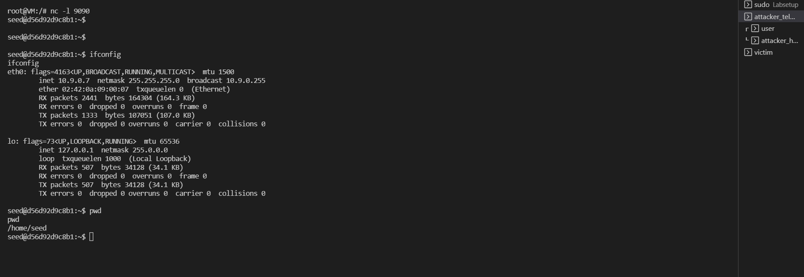