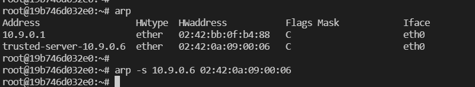
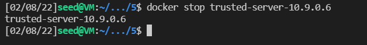
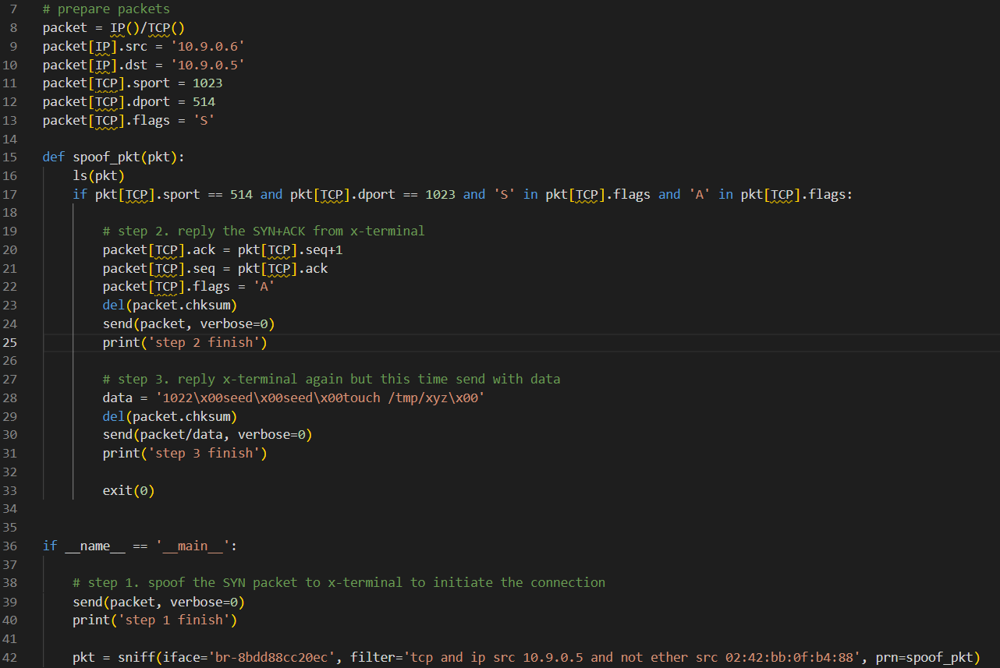
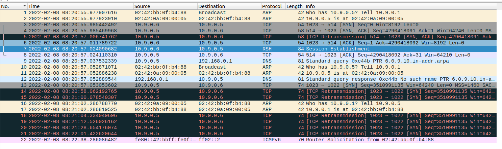
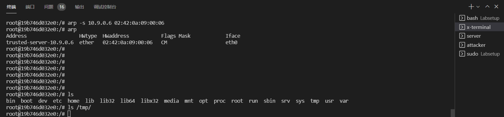
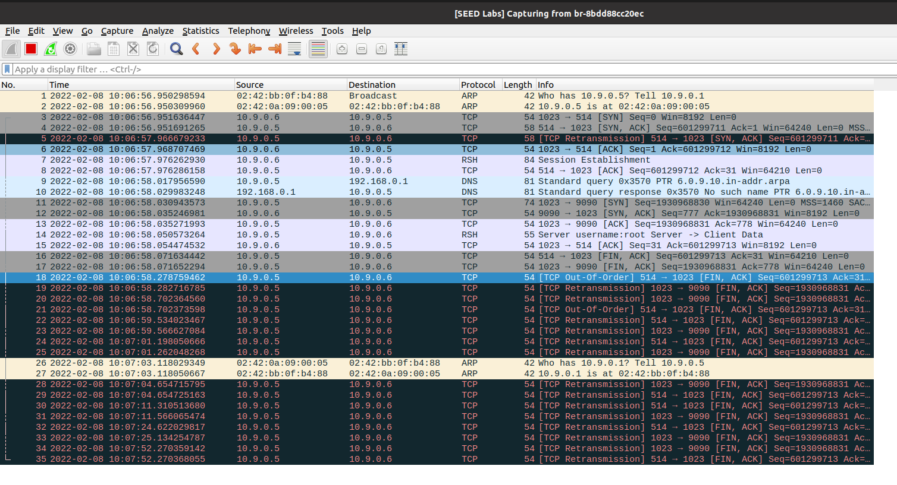
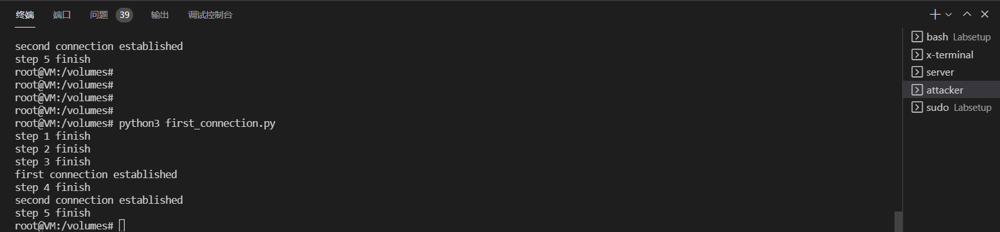
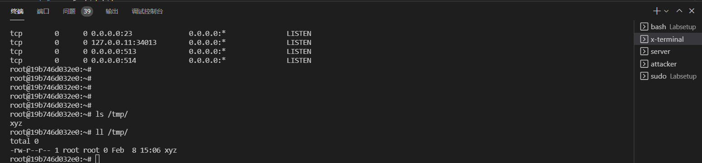
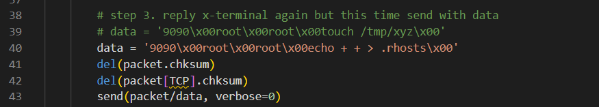
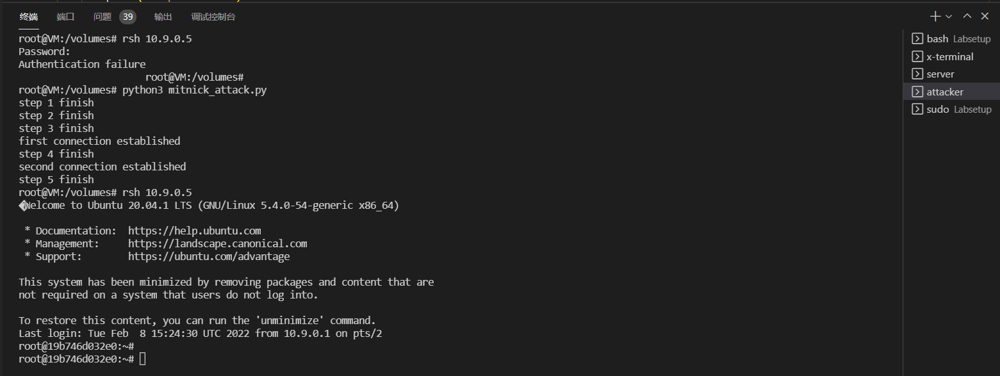

# The Mitnick Attack Lab

## Task 1: Simulated SYN flooding

First, we need to write the MAC address of the trusted server into the arp cache of the x-terminal server. Otherwise, once we stop the trusted-server to stimulate the SYN-flood attack, the packet from x-terminal would never be able to reach the trusted-server since the arp request is never replyed.
To store the MAC address in x-terminal, we could simply ping from x-terminal to trusted-server and then use 'arp -s' to store the MAC address permenately in cache.



Then, we could simply shutdown the trusted-server.



## Task 2.1: Spoof the First TCP Connection

After modifying the codes a little bit, like the followings:



We could sucessfully establish the connection between the server and the x-terminal:



From above figure, we could find that No.7 packet establish the RSH connection.

However, the command loaded in the packet seems not function at all.


## Task 2.2: Spoof the Second TCP Connection

To achieve this, we could simply add more operations in the previous section.
Notice that, there are something need extra attention. For example, we could should change the code given in the instruction

```python
data = '9090\x00seed\x00seed\x00touch /tmp/xyz\x00'
```

to

```python
data = '9090\x00root\x00root\x00touch /tmp/xyz\x00'
```

since if x-terminal seems not has a user called seed, and this bug tortue me for really a long time.

And I put the .rhosts file in the / folder of the root.

Also, if you stuck at some point, the best way to debug I guess is directly use Wireshark to captyre the original 10.9.0.6 rsh connection.

<br>





## Task 3: Set Up a Backdoor

With all work done before, this task is quite easy. All you need is replace the code at the intructions shows.

