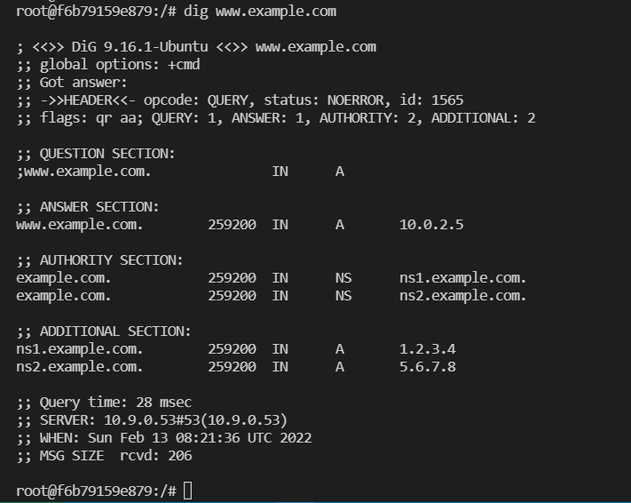
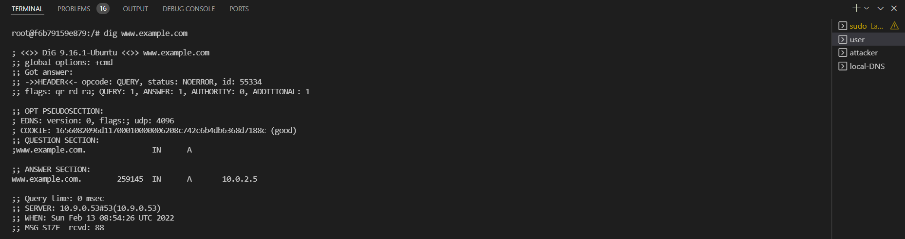
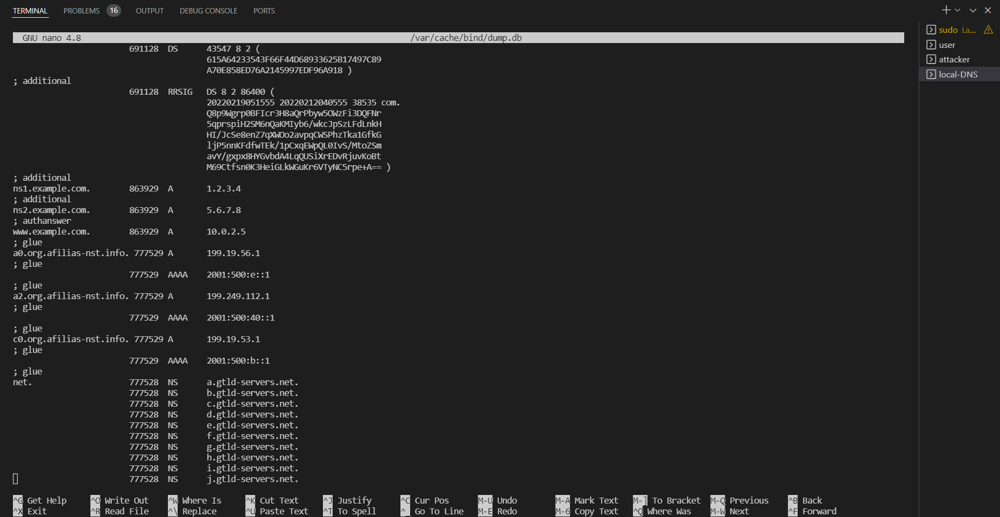
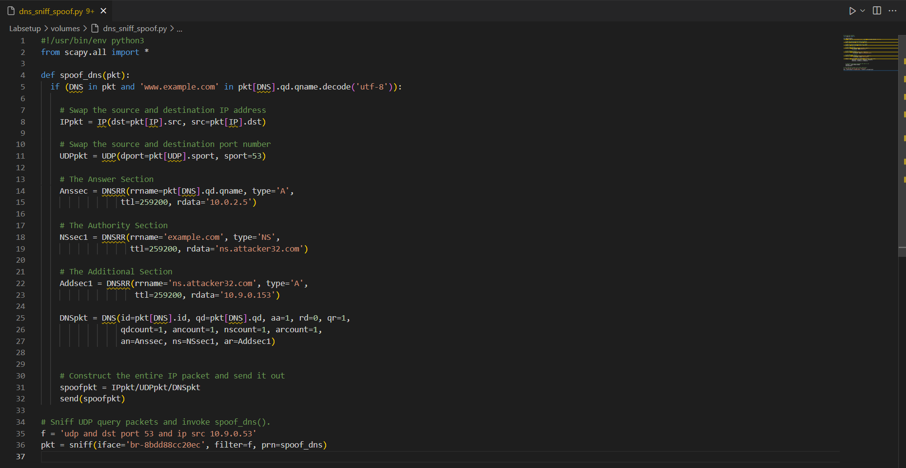
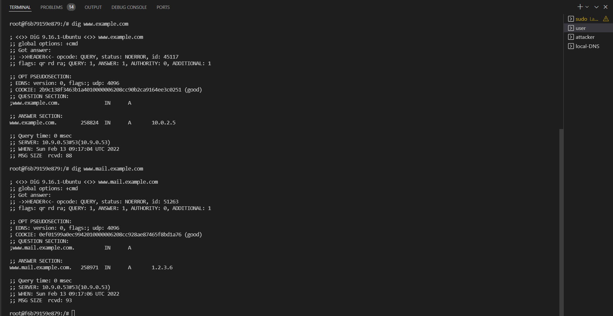
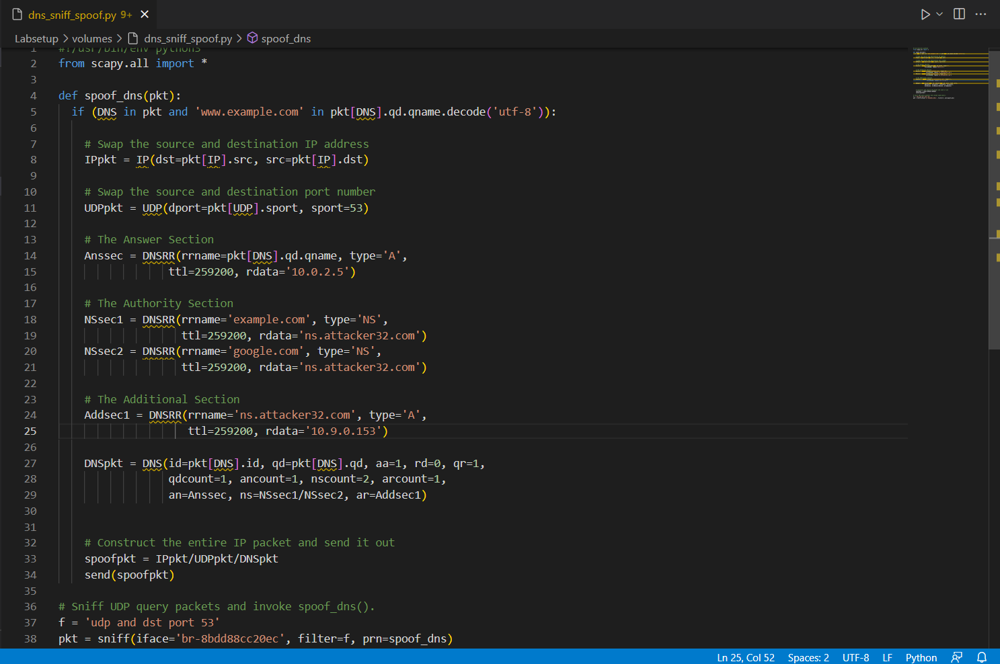
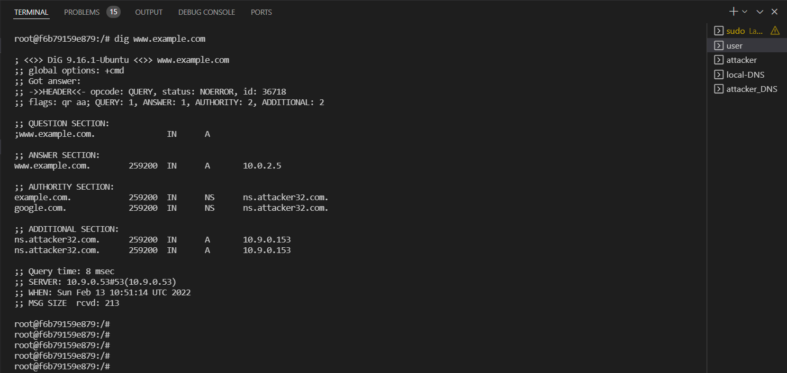
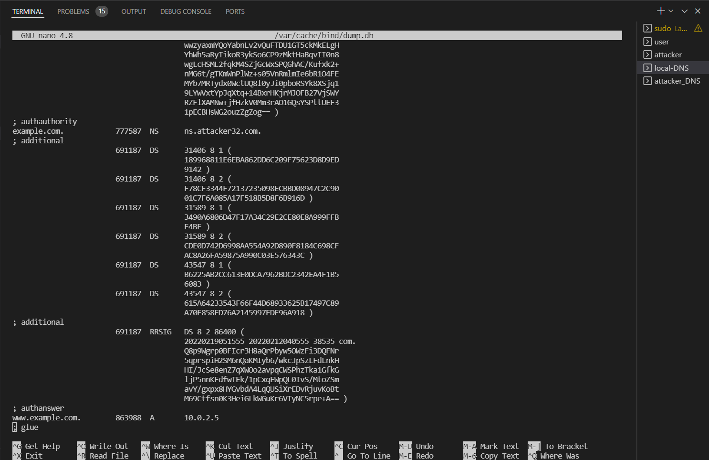
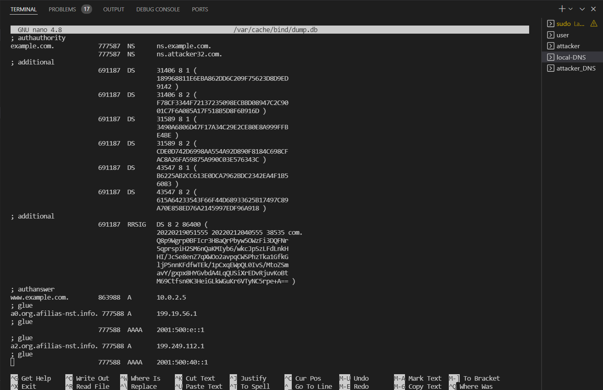

# Local DNS Attack Lab

For this lab, the tasks is relatively easy since all the DNS settings has already be prepared and the codes for the following tasks are already given in the Labsetup.

## Task 1: Directly Spoofing Response to User
First, we need to clean the DNS cache in the local DNS server by typing "rndc flush". 
Then, we just replace the iface address in the given dns_sniff_spoof.py.
Also, need to replace "www.example.net" to "www.example.com". Since we only need to focus on replying the user's DNS query, we could change the filter the code to 'udp and dst port 53 and ip src 10.9.0.5'.
After that, we run "dig www.example.com", we will get the ip address from the spoofed packet. 

 

 

Notice: we only handle the DNS request from the user, which means the DNS server would still reach and get the real ip address of www.example.com.

## Task 2: DNS Cache Poisoning Attack – Spoofing Answers

In this task, we just need to replace the filter in code with 'udp and dst port 53 and ip src 10.9.0.53'

 

We can see the cache of Local DNS is changed.

## Task 3: Spoofing NS Records

We would make use of the Authority section in th reply DNS section. 
Since the template code has already shown us how to add the authority section we just need to modify it a little then we finish. Notice before experiment, you need to flush the cache in the local DNS server.
 
codes: 
 

 
result
 

## Task 4: Spoofing NS Records for Another Domain

To see more clear of our spoofed DNS reply, in this task our program would sniff and reply to the DNS request from user and local DNS server.

 
with result in user machine:
 

 
However, one interesting point is that although we have append the autority information of google.com in our spoofed reply, the local DNS seems not included this new information into its DNS cache.

## Task 5: Spoofing Records in the Additional Section

Modify the codes a little bit, like the followings:

 
From user machine, we could get the following result:

 
However, still, the inrelevant information of DNS request would not be recorded in the local DNS cache, that is, entry(2) and entry(3) are not recored. 
I guess it is one of the countermeasures of the OS to prevent malicoius operation of injecting undesirable ip address.
 
result:

