# The Kaminsky Attack Lab

## Task 2: Construct DNS request

This task is quite easy. We just forge a packet sent from user in the network and then sent it to local DNS server then we could successfully get a valid response from local DNS server and get the result cached in it.
 

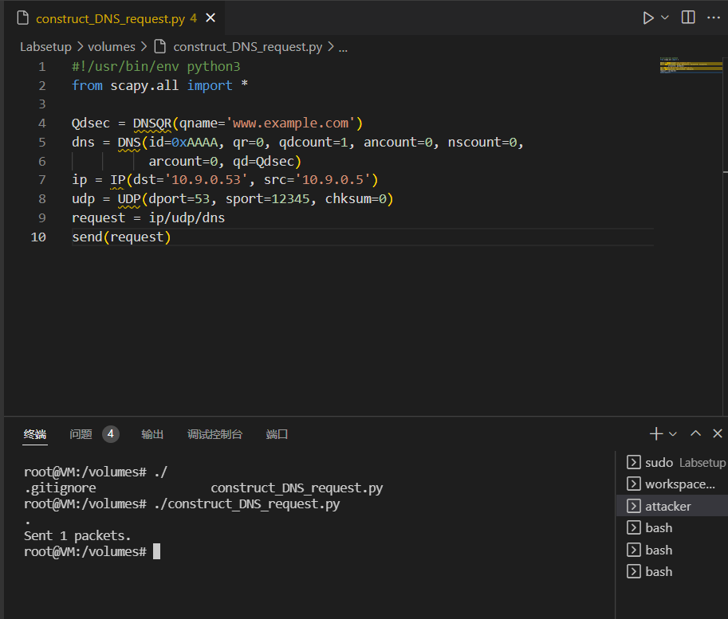
 

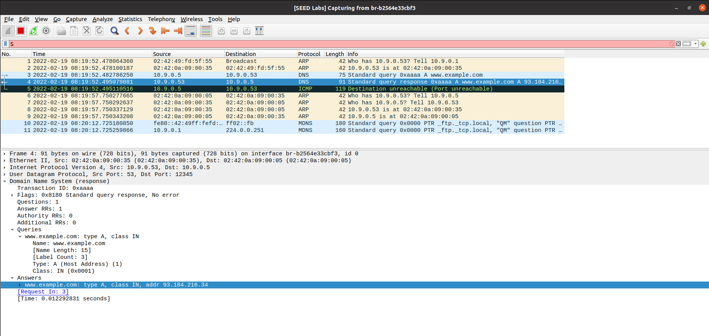

## Task 3: Spoof DNS Replies

Replace the placeholders with some appropriate values, then we could finish this task.
 

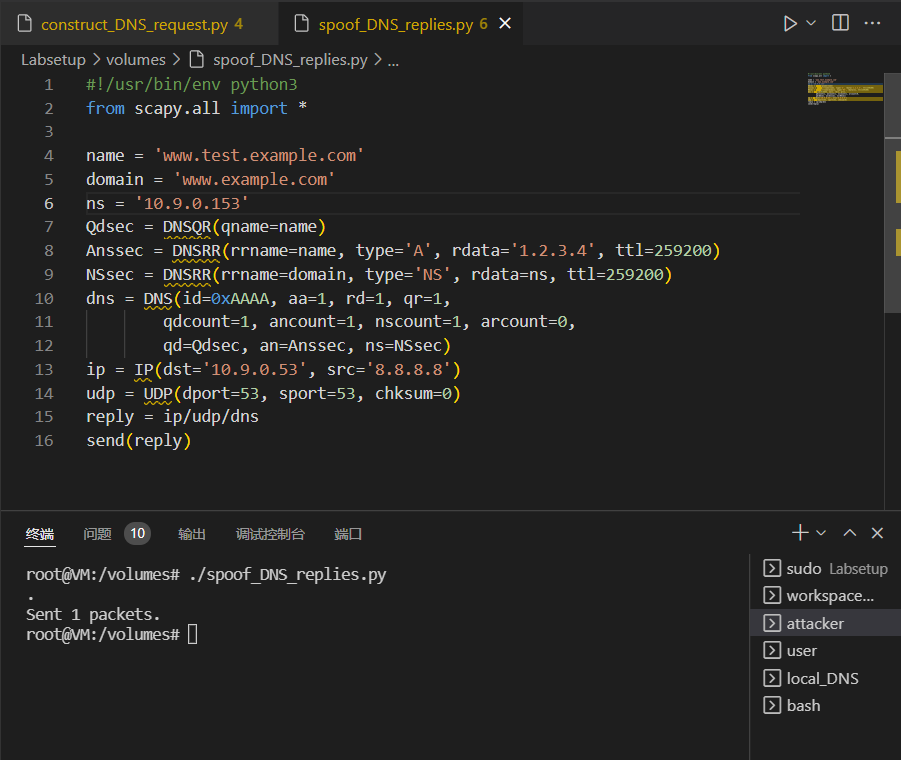
 

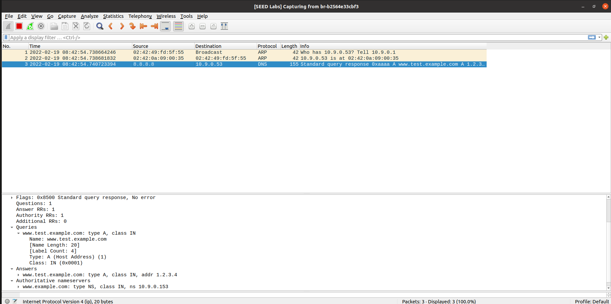

## Task 4: Launch the Kaminsky Attack

In Kaminsky attack, we need to send our packets as fast as possible, since we want to hit the transaction ID of local DNS query before the real query from the real DNS server. Thus, we need to use C codes to do the sending. As Prof. Du, suggested in his course, we would better use Scapy to construct the packet first and store it in a file then C codes would load the packet from the file and only replace some necessary information. 
 

1. use scapy to construct the packets of request from user and spoofed DNS replies.
 

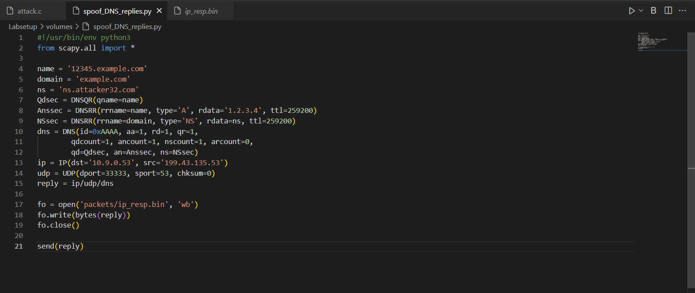
 

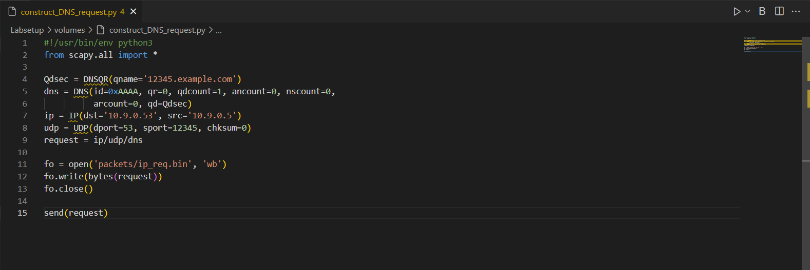

 

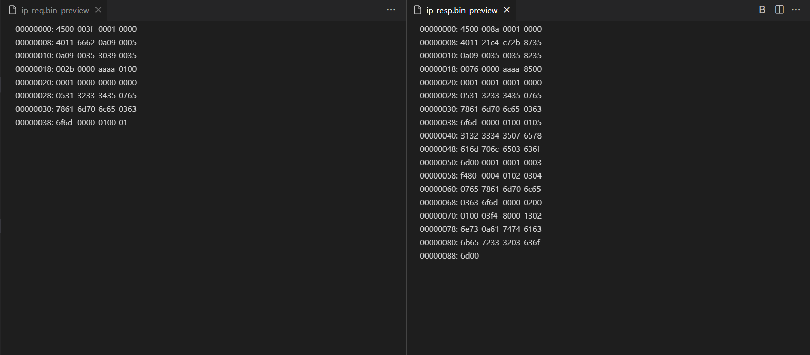

2. load and modify the packets in C

To be specific, we need to modify the subnet name in request's query and responds' quesy and answer parts. Besides, after sending out the spoofed request, we need to modify the responds' transaction ID from 0x0000 to 0xffff (in my codes, I just ignored 0xffff for simplicity) and send them out.
 
But one important question is, how do we (1) modify these fields metioned above and how to (2) locate their position in the packets? 
(1) is quite easy, in C, we could always strong cast the pointer in the packets and modify the fields.
(2) is quite tricky. One typical way is search for the structure of the IP, UDP and DNS packets and count it manually. However, we could use Wireshark directly. In wireshark, we could always check out the detail's information of each packets and show the relations between the fields and the data in the packet. 
For example, to locate the position of subnet name, we could firstly, send a spoofed packet using Scapy and capture it.
 

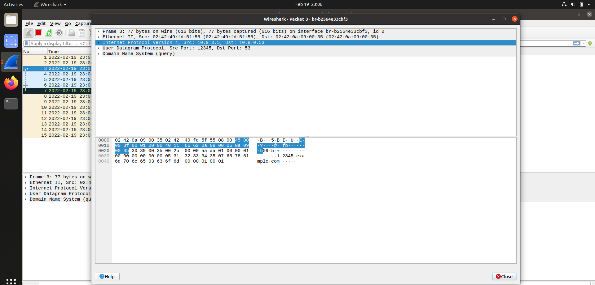
 
We can easily see from above that, the IP header start from the byte with value 0x45, which is the real start point of our packet store in Scapy, since we do not include the Ethernet header. 
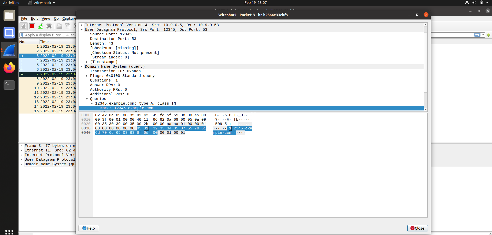
 
Then, we coudl find the start point of the name of the subnet is the byte with value 0x31, that is, (2+5*8-1)-th byte from IP header.
 
**Result**:

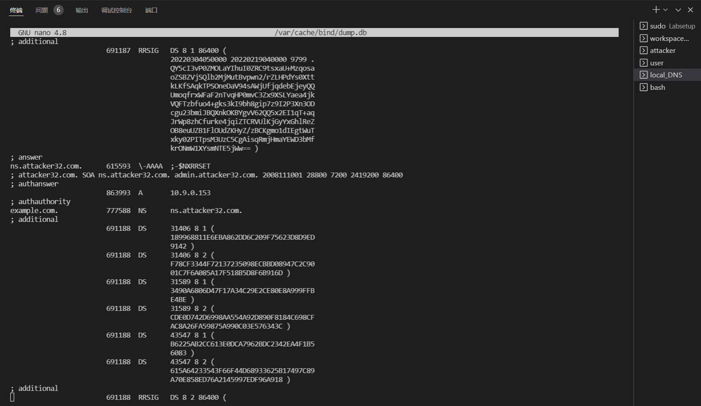
 

Besides, we could use the command provided to check the cache quickly.

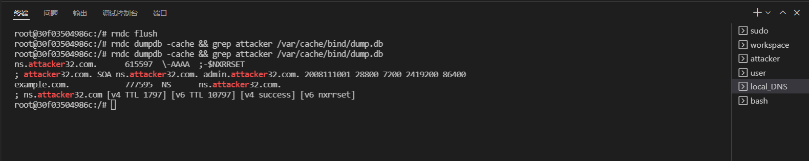

## Task 5: Result Verification

After spoofing, we could verify it by typing dig command to find example.com.
 
**Result:**

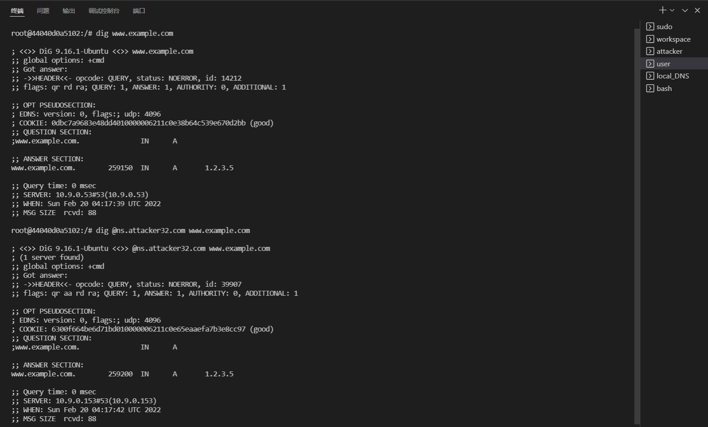

 
As you can see, the above two commands give you the exactly same result which means the fake IP of our spoofed nameserver is stored in the cache.