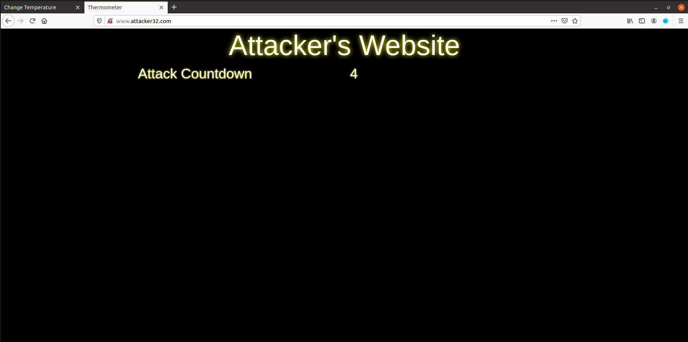
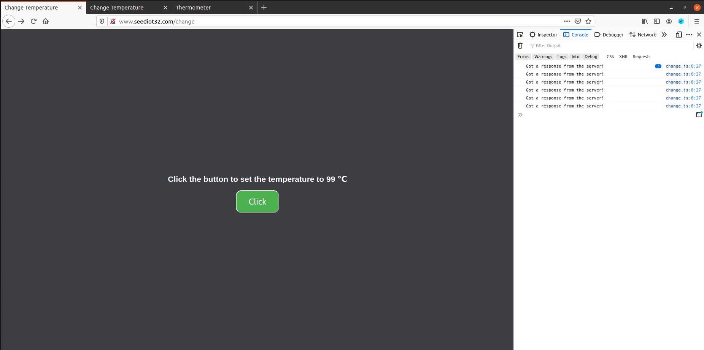
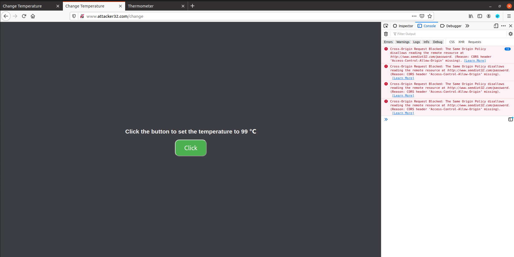
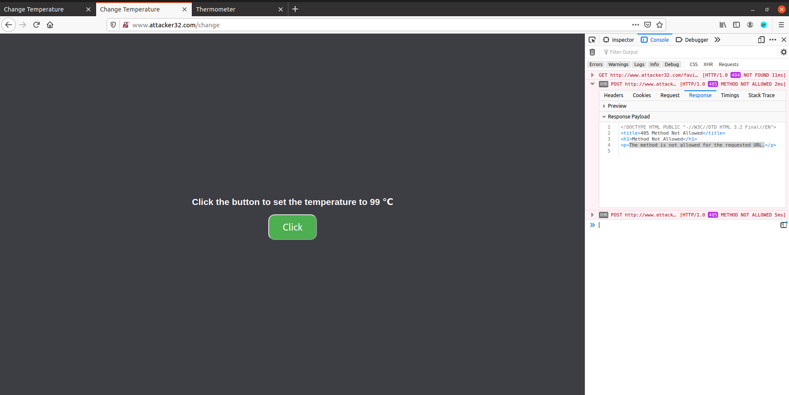
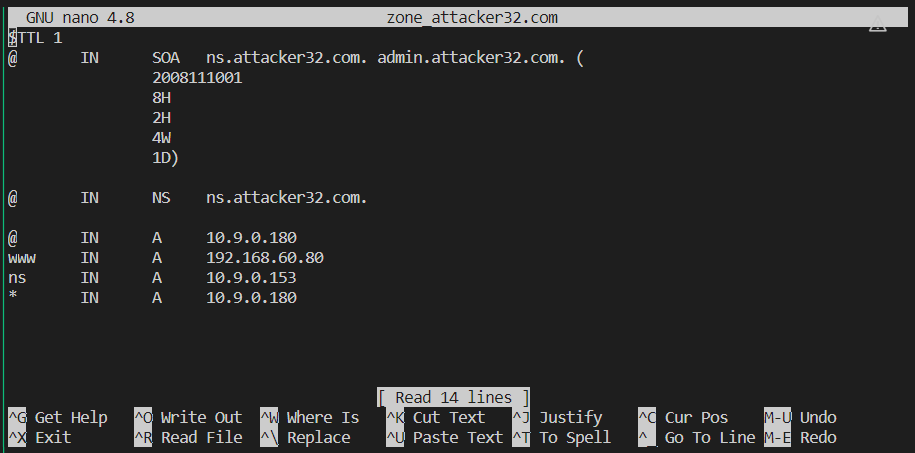
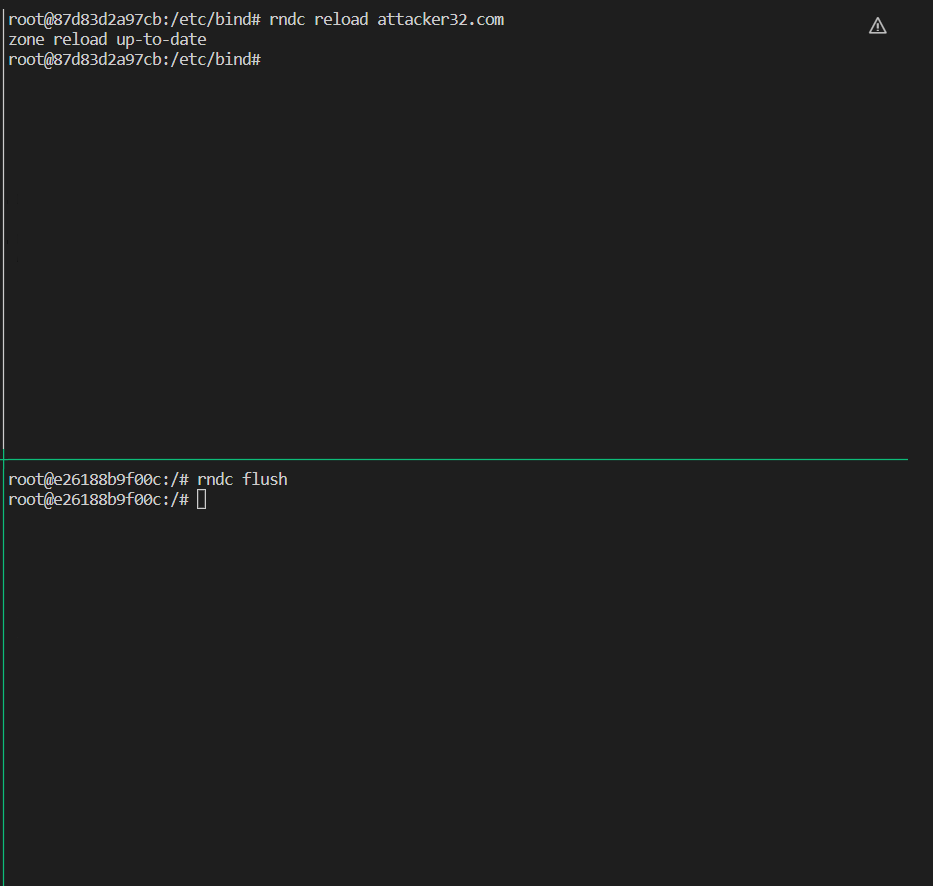
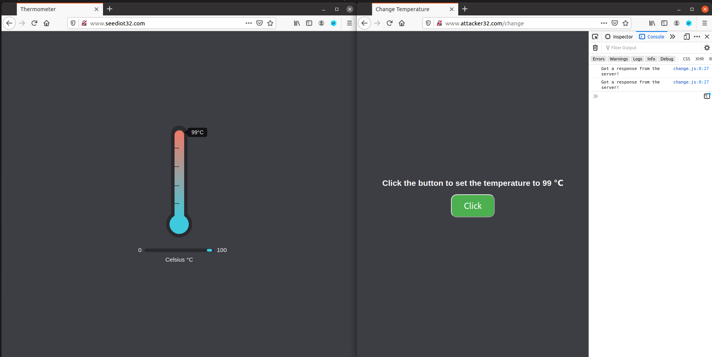
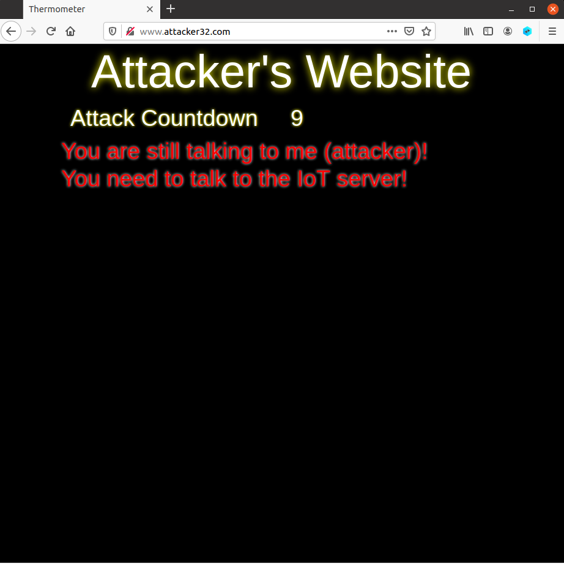
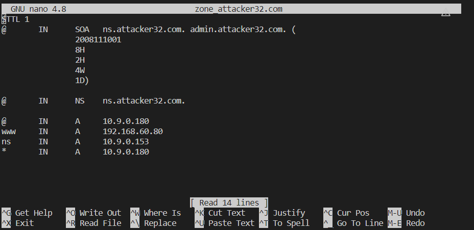

# DNS Rebinding Attack Lab

## before task

After appending the local DNS server in the system, we could find browse the attacker32.com successfully.

## Task 1

"seediot32.com/change" would work while "attacker32.com/change" would not work which is resulted from the same-policy-protocal.

For "seediot32.com/change", it sends request to "seediot32.com/password" which is under the same origin "seediot32.com" so the browser would not block this request. However, request will be blocked for "attacker32.com/change" web.

## Task 2

### Step 1: Modify the JavaScript code

After modification and restart the containre, error message could still be captured in the console. However, this error is not the same-origin-policy but the request is not allowed. Maybe the attacker's web just simply not set up this Post request.

## Step 2: Conduct the DNS rebinding

Just need to modify the filed of **www** in the attacker nameserver will work. Also, modify the **TTL** field would make it work faster.

Before it works, we need to reload the attacker's nameserver. And we could also flush the local dns server to make it takes effect faster.

Then we reopen the web of attacker32.com/change it will work.

## Task 3

This task may be a little confused. Notice that using the automated attack web page means loading its codes to local to let it works, which means we could load the codes of page inside our browser and not close it, then modify the attacker's nameserver. Since we loaded the automated attack web page already, the codes inside would takes effect as long as we keep the page open. This is quite critical to keep the page open, since after we change the attacker's nameserver, next time we open the attacker32.com it will bind to the **new binded ip** we just set.

Steps:
**!!!Notice: after changing attacker's nameserver's settings, you need to reload it!**

 

 

 

